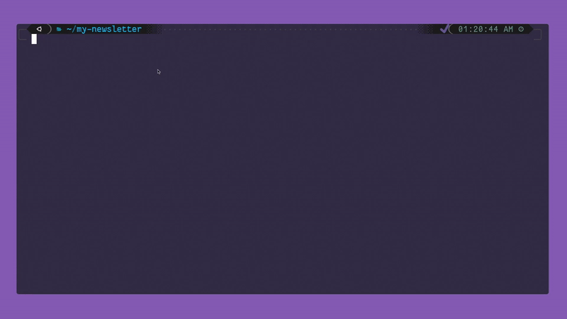

# Kal

Kal is a self-hosted, open-source, serverless CLI-based email newsletter app.

Kal exposes a public REST API to manage subscribers, enabling you to set up custom frontends (e.g., subscribe forms) or other automation.

You can write and send emails using the CLI from any machine (Windows / Linux / Mac OS).

Get started quickly by following the [15-minute Quick Start Guide](https://tanay.xyz/posts/launch-your-email-newsletter-with-kal).

### How it works

**TODO**

### Contributing

**TODO**

## Tasks and planned features

### Next Up

- [ ] Tracking and analytics
    - [ ] UI for analytics
- [ ] Landing page and launch video

### TODO

- [ ] Notify when a sender starts failing
- [ ] Support for non-SMTP email providers
- [ ] Support for multiple lists
- [ ] Managing senders and lists using CLI
- [ ] Email deliverability and concurrency
- [ ] Sequences
- [ ] Custom automations
- [ ] Styling
- [ ] Paid subscriptions
- [ ] Bulk subscriber import
- [ ] Referrals
- [ ] Webhooks
- [ ] Images and attachments with S3
- [ ] Pending emails, undo send, sent logs
- [ ] Package and release CLI separately

### Done

- [x] Confirmation email
- [x] Unsubscribing
- [x] Scheduling emails
- [x] Filters while sending
- [x] Authentication
- [x] Config command
- [x] Templates
- [x] Support for multiple users
- [x] Support for multiple SMTP servers
- [x] Move out of Secrets Manager
- [x] Getting started tutorial
- [ ] Tracking and analytics
    - [x] Open rates, link clicks

---

### Why do you call it Kal?

It's named after Kaladin from [the Stormlight Archive](https://www.goodreads.com/series/49075-the-stormlight-archive),
who is one of my favorite fictional characters.
I think it goes well as a name for a CLI too.
